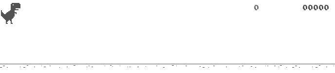
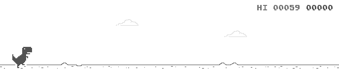

# model-chrome-dino

## Demo!

### Random


### Deep Q-Network


## Installation

The chrome driver is set to match chrome major version 145.

### 1. `git clone` this repository

It will serve as a template for your model repository.

Run following commands to ensure all submodules are properly installed.

```
git submodule init
git submodule update --remote --recursive
```

### 2. Install chrome

If you're working on linux, use the following command to download full chrome.

```
wget https://dl.google.com/linux/direct/google-chrome-stable_current_amd64.deb
```

I've tried using `chromium`, which didn't work. I recommend using full chrome instead.

If you're working on Win/Mac, download full chrome via official website. The major version should be 145. Let me know if the version number does not match.

### 3. Install `gym-chrome-dino`

Use the following command to install dependencies in your environment.

```
pip install -r ./bin/gym-chrome-dino/requirements.txt
```

Use the following line to install gym library in your environment.

```
pip install -e ./bin/gym-chrome-dino
```

If you can't load the library properly, initialize and update submodules first.

```
git submodule init
git submodule update --remote --recursive
```

## Gymnasium usage

The original documentation includes few bugs. I've listed fixes below.

To turn on the default acceleration of the game, add the following line.

```
env.unwrapped.set_acceleration(True)
```

To set a custom value for the acceleration, use the following line.

```
env.unwrapped.game.set_parameter("config.ACCELERATION", [VALUE])
```

